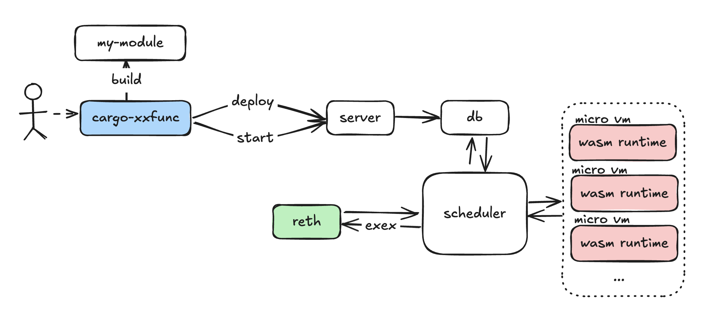

# xxfunc

> **Warning:** This codebase is experimental and not production ready 🚧

`xxfunc` is serverless function support on reth using exex (execution hook).
We compile arbitrary code to `WASI` module and when exex hook is triggered, it will spawn a new wasm runtime and execute the code.

## Motivation

Not many people are able to run or manage their own node. However, many people want to run logic on top of the resource. This was the motivation behind the invention of ["serverless functions"](https://en.wikipedia.org/wiki/Serverless_computing). We wanted to provide the same ability for Ethereum full nodes.

## Architecture

- [`cargo-xxfunc`](./cargo-xxfunc/): cli tool to build, deploy, start serverless function.
- [`exex`](./exex/): reth + scheduler binary. Use execution hook to listen event and scheduler scraps all active tasks and spawn runtimes
- [`server`](./server/): public endpoint to submit function. interact with db.



## Define serverless function

check out [example](./example/)

```
#![no_main]

#[xxfunc::main]
async fn main(data: &[u8]) {
    println!("🦀 Hello, world from wasi!, exex notification data: {:?}", data);
}


```

## Demo

terminal 1 (server)

```
RUST_LOG=info cargo run -p server
```

terminal 2 (user)

Build arbitrary wasm module and deploy it to the server. And set state to started.

```
cargo xxfunc build
cargo xxfunc deploy --url http://0.0.0.0:3000 --wasm-path ./wasm_output/output.wasm
cargo xxfunc start --url http://0.0.0.0:3000 --module-name output.wasm
```

terminal 3 (reth + scheduler)

Run reth with wasm run time scheduler. For testing purpose, we added script to send mock exex notification per every 10 seconds.

```
ETHERSCAN_API_KEY={ETHERSCAN_API_KEY} cargo run -p xxfunc-exex -- node --debug.etherscan --chain holesky --http 
```

## Build and Run wasm module

- install `cargo-xxfunc` subcommand
- build wasm module with `cargo xxfunc build`
- run wasm module with runtime test

```console
./scripts/build_run_module.sh
```

## Support

- [x] `cargo xxfunc` support `build`, `deploy`, `start` and `stop`
- [x] #[xxfunc::main] support async main function
- [x] db, server, exex, scheduler

## TODO:

- [ ] add status of functions in the module db. (eg started or stopped)
- [ ] xxfunclib include a handle to the reth datadir and can be called from the main function
- [ ] check WASIX / WasmEdge
